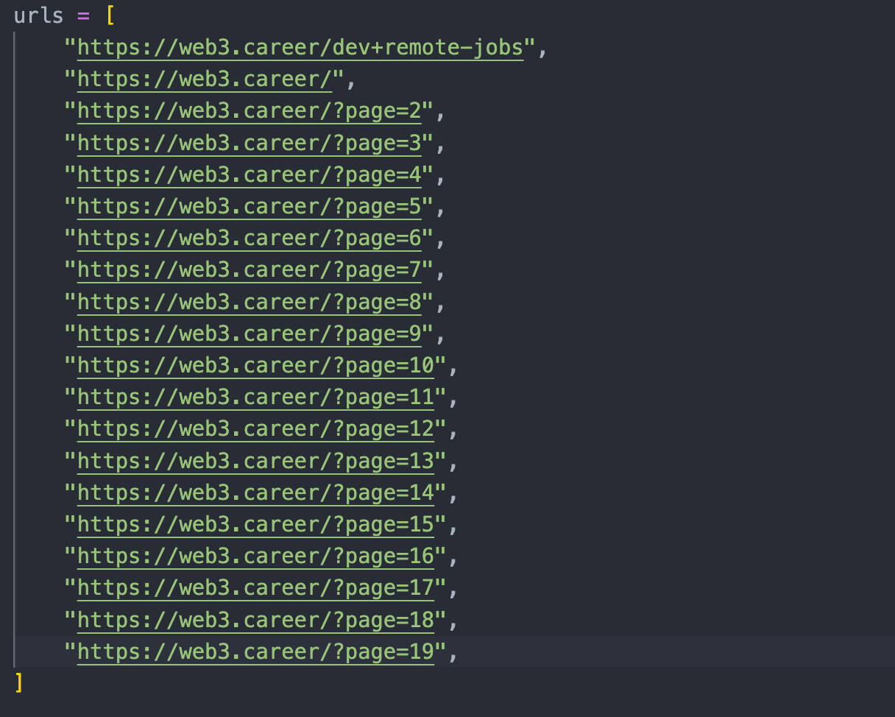
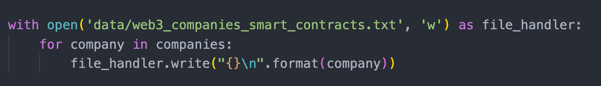

# Webscraper for web3.com

Simple web scraper for the website web3.career

## Description

This simple web scraper extracts list of companies as well as job descriptions. You add all the links you want to be scraped from web3.career and saves data in a .txt file.

## Getting Started

### Installing

Install the required python libraries using the following command. 
```
pip install -r requirements.txt
```

### Executing program

* To scrape companies: 
  * Add your links to the URLs list
  * Change the file name to what you desire 
  * Run the following command 
```
python3 src/web3_scraping_companies.py   
```

* To scrape job descriptions 
  * Add your links to the URLs list
  * Change the file name to what you desire 
  * Run the following command 
```
python3 src/web3_scrapping_job_descriptions.py  
```

### Help
Reference when adding links and changing file names.  

* Adding Links 


* Changing file names 

